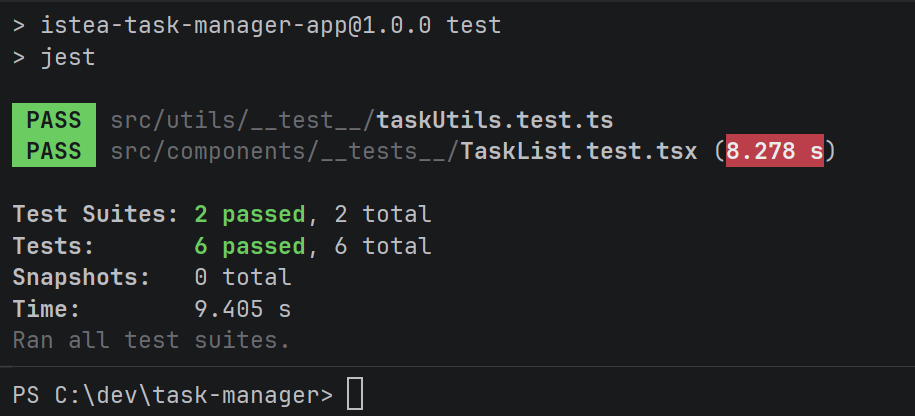

# ISTEA Task Manager
Proyecto parcial de tipo **gestor de tareas** para la materia Aplicaciones Móviles de la Tecnicatura en desarrollo de Software de ISTEA.


# Tecnologías

| Tecnología | Versión | Uso |
| --- | --- | --- |
| Expo | SDK 57 | Plataforma de desarrollo y ejecución multiplataforma |
| React Native | 0.86.3 | Desarrollo de la aplicación móvil |
| React | 19.2.3 | Biblioteca base para la interfaz |
| Expo Router | ~57.0.24 | Navegación y enrutamiento basado en archivos |
| TypeScript | ~6.0.3 | Tipado estático |
| React Native Web | ~0.21.0 | Ejecución de la aplicación en la web |
| ESLint | ^9.0.0 | Análisis estático y calidad del código |
| Node.js | 20 o superior | Entorno de ejecución para las herramientas del proyecto |


# Primeros pasos

Se requiere Node.js 20 o superior.

## 1. Instalar las dependencias del proyecto

   ```bash
   npm install
   ```

## 2. Correr la aplicación en emulador Android

   ```bash
   npx expo run:android
   ```
   
> NOTA: 
> Primero se debe tener un emulador con Android corriendo. La compilación puede demorar unos minutos. 

## 3. Pruebas unitarias
```bash
npm test
```

## 4. Evidencia de pruebas unitarias


# Funcionalidades

## Registro, login y logout
Se implementó una autenticación básica utilizando un componente reutilizable llamado AuthForm, el mismo sirve tanto para registrarse como para iniciar sesión.

La aplicación contiene un botón para hacer logout que remueve la sesión iniciada del storage.

> AuthForm contiene las distintas validaciones, email, password, etc.

## Administración de tareas
Al iniciar sesión en la aplicación tenemos un botón para movernos a la pantalla de **Alta**, dentro de esta pantalla podremos crear tareas, eliminarlas y también ponerles notificaciones.

La home de la aplicación muestra las tareas creadas, permite borrarlas y agregarles notificaciones, también contiene una sección especial que reutiliza el componente TasksLists pero solo para mostrar tareas finalizadas.